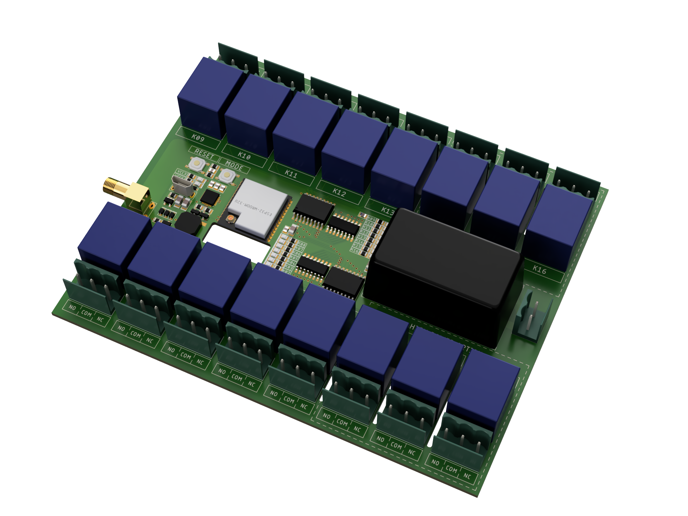
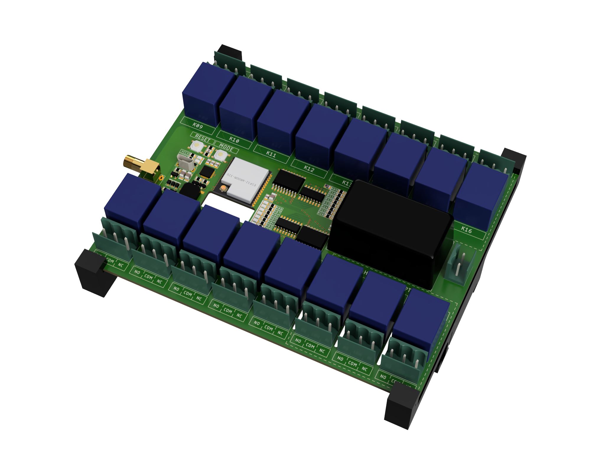

## Guidline

1. Order PCB by uploading the [Gerber File](pcb/cam/esp-module-cu.zip) to [JLCPCB](https://jlcpcb.com/).
2. Order Parts by uploading the [BOM File](pcb/bom/esp-module-cu.csv) to [LCSC](https://www.lcsc.com/bom).
3. Download & Install [Git](https://git-scm.com/), [CP210x Driver](https://www.silabs.com/developers/usb-to-uart-bridge-vcp-drivers?tab=downloads) and [VSCode](https://code.visualstudio.com/) with [PlatformIO](https://platformio.org/) Extension.
4. Clone the Repository `git clone --recursive https://github.com/LaCocoRoco/esp-module-cu.git`.
5. Customize your desired IO behaviour in [io.cpp](https://github.com/LaCocoRoco/esp-module-codebase/blob/main/src/io.cpp) or use the existing code from the [home](https://github.com/LaCocoRoco/esp-module-codebase/tree/home) branche.
6. With PlatformIO `Upload Filsystem Image` & `Upload & Monitor ` to your board.

## Reference

- Interactive [BOM Viewer](https://htmlpreview.github.io/?https://github.com/LaCocoRoco/esp-module-cu/blob/main/pcb/bom/esp-module-cu.html)

## Preview

